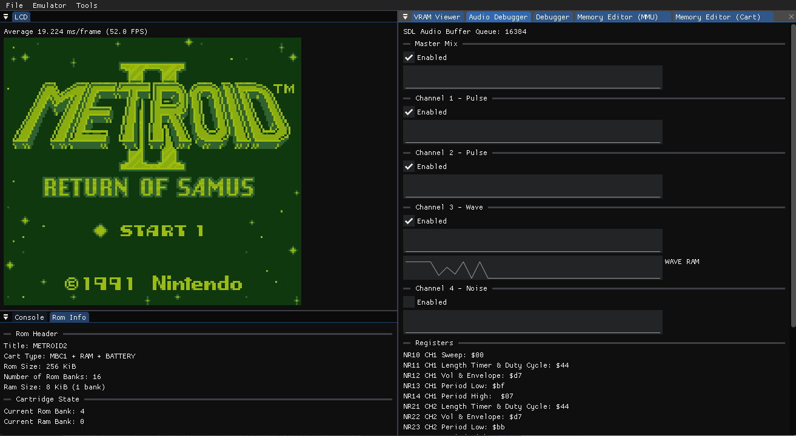
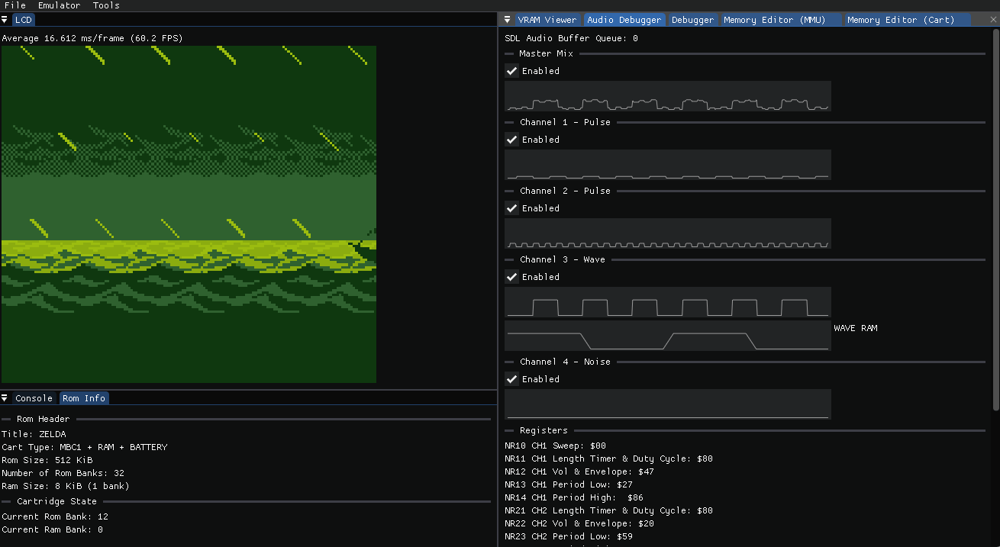
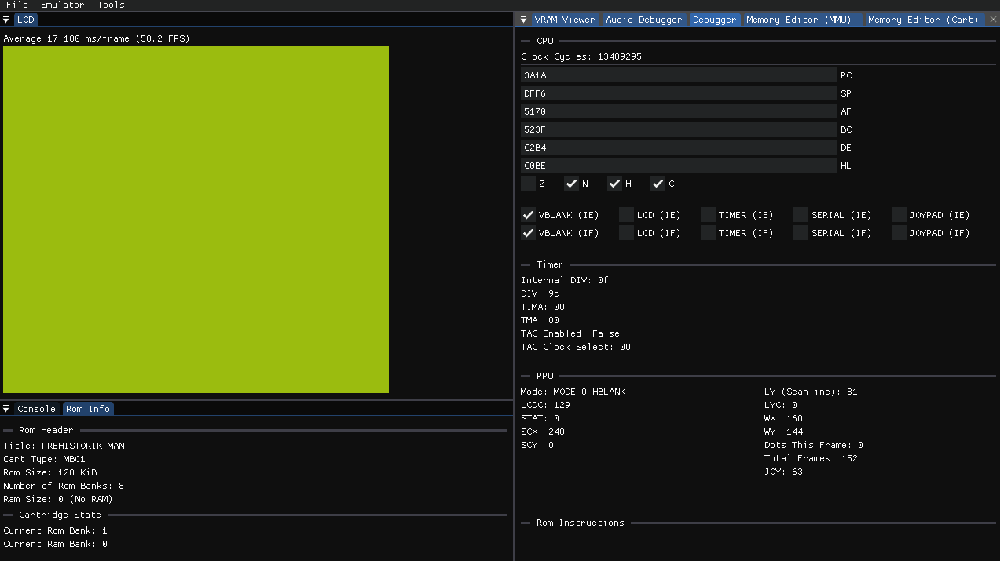
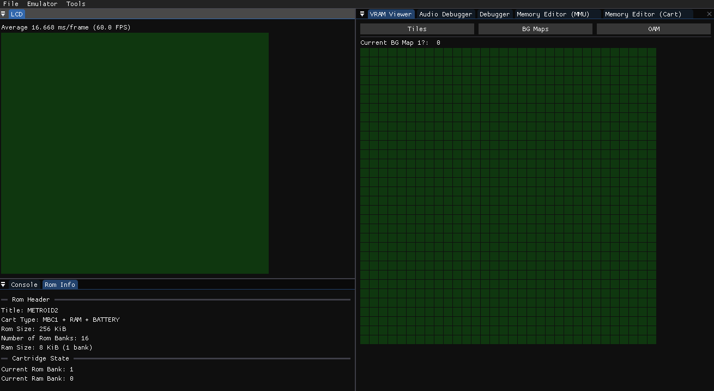
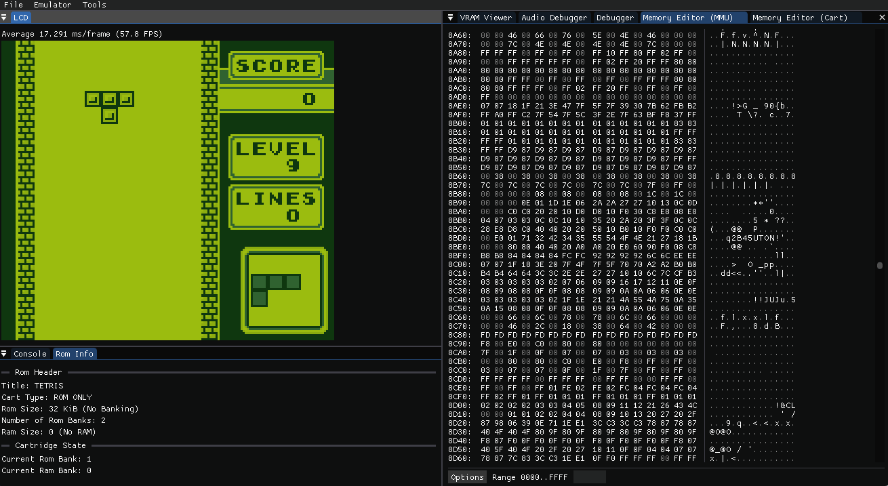

# DotMatrixBoy
DotMatrixBoy is a Game Boy emulator written in C++ that emulates the first-generation DMG model. This project is a learning exercise designed to provide a deeper understanding of hardware architecture and emulator design.

**Please note**: This emulator is highly experimental and not intended for general use. It is primarily a tool for educational purposes and may contain bugs or incomplete features.

## Features
- MBC 1 Support
- Cart (ROM) Details
- VRAM Viewer
- Audio Debugger
- Memory Editor
- CPU Instruction Unit Tests

## Media
### Audio Debugger

### Debug Stats

### VRAM Viewer

### Mem Editor

## Controls
| Key | Description |
|-----------------------------|-----------------------------|
| **Arrow Keys** | D PAD    |
| **A**          | A Button |
| **S**          | B Button |
| **Tab**        | Select   |
| **Enter**      | Start    |

# Test Results
[Blargg's tests](http://gbdev.gg8.se/wiki/articles/Test_ROMs):

| Test | Result |
| --- | --- |
| cgb\_sound | N/A |
| cpu\_instrs | :ok: |
| dmg\_sound | :x: |
| halt\_bug | :x: |
| instr\_timing | :x: |
| interrupt\_time | :x: |
| mem\_timing | :x: |
| oam\_bug | :x: |

## Requirements
- Visual Studio (Not required, however the premake scripts only support VS.)
- Windows (Currently the premake scripts only support Windows.)

#### Compiling
Once you have cloned, run the `Setup-Windows.bat` script to generate solution/project files for Visual Studio.

## 3rd Party Libraries
- [SDL 2](https://www.libsdl.org/)
- [Dear ImGui](https://github.com/ocornut/imgui)
- [Dear ImGui File Browser](https://github.com/AirGuanZ/imgui-filebrowser)
- [Dear ImGui Memory Editor](https://github.com/ocornut/imgui_club)
- [Nlohmann JSON](https://github.com/nlohmann/json)
- [Audio File](https://github.com/adamstark/AudioFile)
